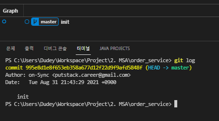
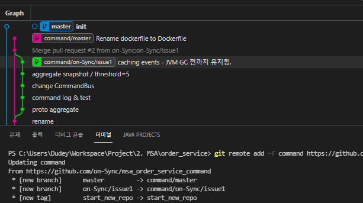
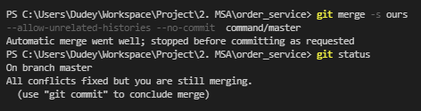
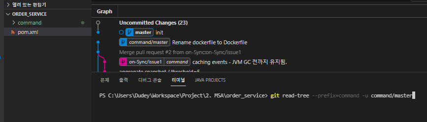
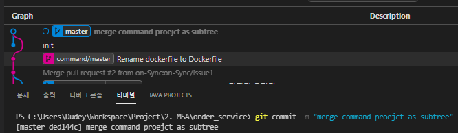
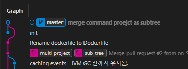

# Repository Merge

- 저장소를 병합하여 사용하는 방법은 두가지 전략이 있다.

## Sub Module

- 계층구조가 있지만, 별도로 관리되어야 하는 경우 사용한다.
- `Git` 자체는 모듈(프로젝트)별로 주어지며, 유연한 병합 방법이다.
- 자세한 내용은 [Git Document](https://git-scm.com/book/ko/v2/Git-%EB%8F%84%EA%B5%AC-%EC%84%9C%EB%B8%8C%EB%AA%A8%EB%93%88) 참고
- 주요개념은 다음과 같다.
- Git 저장소 안에 다른 Git 저장소를 디렉토리로 분리해 넣는 것이 서브모듈이다. 다른 독립된 Git 저장소를 Clone 해서 내 Git 저장소 안에 포함할 수 있으며 각 저장소의 커밋은 독립적으로 관리한다.

## Sub Tree

- Git 저장소 SCM 자체를 병합하는 방법이다.
- 이 방법을 이용하면 여러 프로젝트가 공통소스를 갖는 경우, Mono Repository 방식으로 변경할 수 있다.

### Example

> 나는 CQRS 테스트 후, 병합중에 사용했다. CQRS 에서 Event Class 는 Command Service 와 Query Service 에서 공통사용한다. 두 서비스를 각 프로젝트로 구현했고 테스트 이후 이를 Maven 의 `Multi Module` 로 변경하기 위해 사용했다.

#### 1\. 부모프로젝트에 하위프로젝트 정보전달

```cli
cd {parent-project}
git remote add -f command ${command-remote-repo}.git
```

> Fetch 를 통해 부모프로젝트의 `.git`에 하위프로젝트 브랜치들의 정보를 주입한다.




#### 2\. 무관한 브랜치 이력들의 병합관계 지정

```cli
git merge -s ours --allow-unrelated-histories --no-commit command/master
```

> Merge 를 수행한다.
> 
> - `-s ours` 기존내용을 우선시 한다.
> - `--allow-unrelated-histories` 현재와 같이 무관한 기록을 병합한다. 시간열에 따라 적용된다.
> - `--no-commit` 병합을 대기시킨다. 현재 병합은 부모프로젝트 루트에 그대로 기록을 병합하기 때문에 `Working Directory`의 상태변화로 인지한다. 우리는 해당 병합대상에 접두사를 지정하여 저장위치를 하위폴더로 지정할 것이다.



#### 3\. 하위폴더 지정 및 병합진행

```cli
git read-tree --prefix=${dest-dir} -u command/master
git commit -m "merged"
```

> - `--prefix` 접두어로 하위 폴더형식을 지정해준다.
> - `-u` Working Directory 를 병합상태로 업데이트한다.
> - 업데이트 이후에 변경사항을 커밋으로 기록한다.




#### 4\. Pulling 전략

```cli
git pull -s subtree command master
```

> - Remote Repository 를 유지한다면 Pulling 전략을 지정한다.
> - Sub Tree 전략내용은 다음과 같다.
> - This is a modified recursive strategy. When merging trees A and B, if B corresponds to a subtree of A, B is first adjusted to match the tree structure of A, instead of reading the trees at the same level. This adjustment is also done to the common ancestor tree.
> - 나는 해당 Remot Repository 를 삭제한 후, Tag 를 달아주는 것으로 마무리한다.



## Reference

- [stackoverflow : How do you merge two Git repositories?](https://stackoverflow.com/questions/1425892/how-do-you-merge-two-git-repositories)