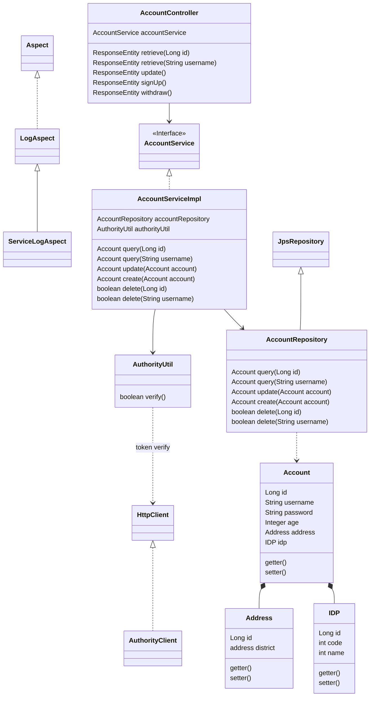
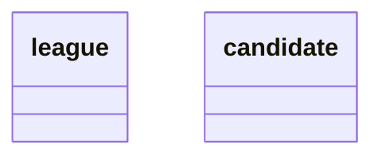

```mermaid
classDiagram
    class Aspect { }
    Aspect <|.. LogAspect
    class LogAspect { }
    LogAspect <|-- ServiceLogAspect
    class ServiceLogAspect { }

    class AccountController {
        AccountService accountService
        ResponseEntity retrieve(Long id)
        ResponseEntity retrieve(String username)
        ResponseEntity update()
        ResponseEntity signUp()
        ResponseEntity withdraw()
    }

    AccountController --> AccountService
    class AccountService {
        <<Interface>>
    }

    AccountService <|.. AccountServiceImpl
    class AccountServiceImpl {
        AccountRepository accountRepository
        AuthorityUtil authorityUtil
        Account query(Long id)
        Account query(String username)
        Account update(Account account)
        Account create(Account account)
        boolean delete(Long id)
        boolean delete(String username)
    }

    AccountServiceImpl --> AuthorityUtil
    class AuthorityUtil {
        boolean verify()
    }

    AuthorityUtil ..> HttpClient : token verify
    class HttpClient { }

    HttpClient <|.. AuthorityClient
    class AuthorityClient { }

    
    JpsRepository <|-- AccountRepository
    AccountServiceImpl --> AccountRepository
    class AccountRepository {
        Account query(Long id)
        Account query(String username)
        Account update(Account account)
        Account create(Account account)
        boolean delete(Long id)
        boolean delete(String username)
    }

    AccountRepository ..> Account
    class Account {
        Long id
        String username
        String password
        Integer age
        Address address
        IDP idp
        getter()
        setter()
    }

    Account *-- Address
    class Address {
        Long id
        address district
        getter()
        setter()
    }

    Account *-- IDP
    class IDP {
        Long id
        int code
        int name
        getter()
        setter()
    }
```

```mermaid
classDiagram
    class league {
        
    }

    class candidate {

    }

```