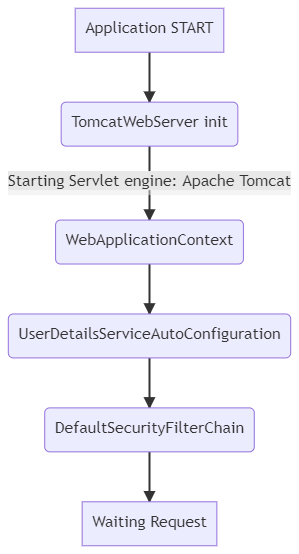
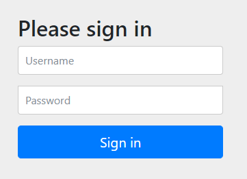

### 1. Spring Security 프로젝트

#### 1.1. dependencies

##### 필수 !

```gradle
implementation 'org.springframework.boot:spring-boot-starter-security'
```

##### 선택 ?
```gradle
implementation 'org.springframework.boot:spring-boot-starter-web'
//implementation 'org.springframework.boot:spring-boot-starter-webflux:2.6.0'
```

- spring security 는 `Filter Chain` 구조를 기반으로 보안을 제공한다.
- 필터는 WAS 형식에 따라 적용방법이 다르다.
- `servlet` 의 경우 `HttpSevletRequest` , `HttpSevletResponse` 를 사용한다.
- `webflux` 의 경우 `ServerRequest` , `ServerResponse` 를 사용한다.
- 이는 WAS 형식에 따른 동작방식의 차이에서 비롯되기에 사용할 WAS 에 따라서 의존성을 선택한다.
- 여기서는 `servlet` WAS 를 사용한 내용을 설명한다.

#### 1.2. Filter Chain

    
<details>
<summary>Diagram source</summary>
    
```
graph TD
    S[Application START]
    R[Waiting Request]
    A(TomcatWebServer init)
    B(WebApplicationContext)
    C(UserDetailsServiceAutoConfiguration)
    D(DefaultSecurityFilterChain)
    S --> A
    A -- Starting Servlet engine: Apache Tomcat --> B
    B --> C --> D --> R
```
    
</details>

- 서블릿는 구동시 Spring Security 의존성 등록을 확인하면 기본 보안설정을 추가한다.
- 기본 보안은 form 형식의 id/password 인증방식을 제공한다.
- 이때 기본 사용자정보 서비스를 위해 `UserDetailsServiceAutoConfiguration` 를 적용하고
- 필터기반 보안방식을 제공하기 위해 `DefaultSecurityFilterChain` 을 적용한다.

#### 1.3. Login



- 위와 같은 로그인화면의 URL 은 기본적으로 `/login` 으로 제공되며, 비로그인시 권한을 위해 `redirection` 된다.


- `UserDetailsServiceAutoConfiguration` 은 `default userdetails` 를 생성하고 비밀번호를 Info 로그를 통해 제공한다.
- 위 비밀번호와 기본 Username 인 `user` 를 입력하여 로그인한다.
- 로그인 정보는 디폴트인 Session 으로 기록된다.
