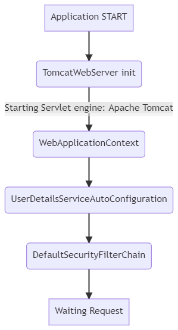
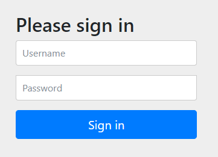
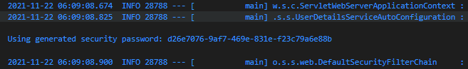
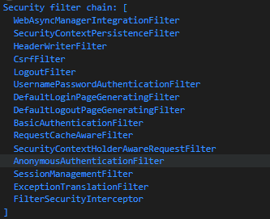

## JWT 인증 구현하기

### 1. Spring Security 프로젝트

#### 1.1. dependencies

##### 필수 !

```gradle
implementation 'org.springframework.boot:spring-boot-starter-security'
```

##### 선택 ?
```gradle
implementation 'org.springframework.boot:spring-boot-starter-web'
//implementation 'org.springframework.boot:spring-boot-starter-webflux:2.6.0'
```

- spring security 는 `Filter Chain` 구조를 기반으로 보안을 제공한다.
- 필터는 WAS 형식에 따라 적용방법이 다르다.
- `servlet` 의 경우 `HttpSevletRequest` , `HttpSevletResponse` 를 사용한다.
- `webflux` 의 경우 `ServerRequest` , `ServerResponse` 를 사용한다.
- 이는 WAS 형식에 따른 동작방식의 차이에서 비롯되기에 사용할 WAS 에 따라서 의존성을 선택한다.
- 여기서는 `servlet` WAS 를 사용한 내용을 설명한다.

#### 1.2. Filter Chain

    
<details>
<summary>Diagram source</summary>
    
```
graph TD
    S[Application START]
    R[Waiting Request]
    A(TomcatWebServer init)
    B(WebApplicationContext)
    C(UserDetailsServiceAutoConfiguration)
    D(DefaultSecurityFilterChain)
    S --> A
    A -- Starting Servlet engine: Apache Tomcat --> B
    B --> C --> D --> R
```
    
</details>

- 서블릿는 구동시 Spring Security 의존성 등록을 확인하면 기본 보안설정을 추가한다.
- 기본 보안은 form 형식의 id/password 인증방식을 제공한다.
- 이때 기본 사용자정보 서비스를 위해 `UserDetailsServiceAutoConfiguration` 를 적용하고
- 필터기반 보안방식을 제공하기 위해 `DefaultSecurityFilterChain` 을 적용한다.

#### 1.3. Login



- 위와 같은 로그인화면의 URL 은 기본적으로 `/login` 으로 제공되며, 비로그인시 권한을 위해 `redirection` 된다.



- `UserDetailsServiceAutoConfiguration` 은 `default userdetails` 를 생성하고 비밀번호를 Info 로그를 통해 제공한다.
- 위 비밀번호와 기본 Username 인 `user` 를 입력하여 로그인한다.
- 로그인 정보는 디폴트인 Session 으로 기록된다.

### 2. @Configuration

#### 2.1. 서블릿 웹보안설정은 Adapter 를 사용한다.

```java
package com.example.jwt.security;

import org.springframework.security.config.annotation.web.configuration.EnableWebSecurity;
import org.springframework.security.config.annotation.web.configuration.WebSecurityConfigurerAdapter;

@EnableWebSecurity(debug = true)
public class WebSecurityConfig extends WebSecurityConfigurerAdapter {
    
}
```

- 서블릿 보안설정은 `WebSecurityConfigurer` 인터페이스로 적용한다.
- 이 인터페이스를 구현은 보통 `WebSecurityConfigurerAdapter` 라는 Adapter 명칭의 추상화된 `base class`를 상속으로 응용한다.
- 이 기본클래스는 추상클래스지만 인터페이스의 기능은 구현되어 있다.
- 즉, 추상메소드와 추상멤버변수는 없기에 사용자는 필요한 설정만 조정하여 사용할 수 있다.

#### 2.2. 요청별 필터목록



- `@EnableWebSecurity(debug = true)` 에서 디버깅 설정을 해두면 Request 에 따른 Filter Chain 을 확인할 수 있다. ( `@EnableWebSecurity` 는 `@Configuration` 기능을 내포 )
- 순차적으로 필터의 적용순서된다.
- 목록내용을 확인하면 해당 Request 에서 적용된 인증, 세션, Csrf 등의 필터클래스를 점검할 수 있다.
- 이 필터들은 기본적으로 `GenericFilterBean` 추상클래스를 상속받는다.
- 이 필터들은 필요에 따라 위 추상클래스를 상속 받은 `OncePerRequestFilter` , `AbstractAuthenticationProcessingFilter` 등의 추상클래스를 사용하여 요청내 중복필터링을 방지, 인증처리를 규격화한 필터로 구현되어 있다.

#### 2.3. Request 별로 요구되는 권한 설정

```java
    @Override
    protected void configure(HttpSecurity http) throws Exception {
        http.authorizeRequests()
                .antMatchers("/", "/css/**", "/images/**","/js/**", "/h2-console/**", "/login**", "/error**").permitAll()
                .antMatchers(HttpMethod.POST, "/users").permitAll()
                .antMatchers(HttpMethod.GET, "/users").hasRole("USER")
                .anyRequest().authenticated();
    }
```

- `authorizeRequests()` 은 `AbstractRequestMatcherRegistry` 를 상속받은 `ExpressionInterceptUrlRegistry` 를 반환한다.
- 해당 Registry 는 `RequestMatcher` 로 지정된 요청 묶음별로 `List<UrlMapping>` 형태로 권한묶음과 함께 관리합니다.
- 지정가능한 권한내용은 `AuthorizedUrl` 에 분류되어 제공됩니다.
- 즉 요청방식별로 허용되는 인증권한이 요구됩니다.

### 3. Authenicataion

#### 3.1. Authenticataion 시 사용자별 권한 부여

- 앞서 요청별 요구권한이 주어졌습니다.
- 이는 사용자의 요청대상이 `permitAll(모두허락)` 이 아닐경우, 로그인에 따른 권한획득이 필요하게 됩니다.
- Spring Security 과 같은 보안에서는 로그인을 `Authentication(인증)` , 권한획득을 `Authorization(권한부여)` 라고 명명합니다.
- 여기서 주어지는 권한을 집합으로 구분하면 다음과 같습니다.
- `Role(역할)` : 여러 동작묶음으로 구분되는 권한
- `Authority(권위)` : 일련 동작에 대한 권한
- `Privilege(특권)` : 일련 동작의 세부항목에 대한 권한

```java
public interface DefaultUserDetailsService extends UserDetailsService { }
```

- 이는 `Authenticataion` 에 사용되는 `UserDetailsService` 인터페이스의 서비스를 재구현함으로 적용할 수 있다.

```java
public class DefaultUserDetailsServiceImpl implements DefaultUserDetailsService {
    @Override
    public UserDetails loadUserByUsername(String email) throws UsernameNotFoundException {
        User user = userRepository.findByEmail(email).orElseThrow(() -> new UsernameNotFoundException(email));
        return new org.springframework.security.core.userdetails.User(
            user.getEmail(),
            user.getPassword(),
            true, // enabled
            true, // accountNonExpired
            true, // credentialsNonExpired  
            true, // accountNonLocked
            user.getRoles() // authorities = Collection<GrantedAuthority>
        );
    }
}
```

- 해당 인터페이스의 `public UserDetails loadUserByUsername(String email)` 함수를 오버라이딩한다.
- 여기서 `UserDetails` 를 상속한 `org.springframework.security.core.userdetails.User` 클래스에 `Collection<GrantedAuthority>` 객체를 권한정보를 전달하여 사용하게 된다.

```java
    @Override
    protected void configure(AuthenticationManagerBuilder managerBuilder) throws Exception {
        managerBuilder.userDetailsService(userDetailsService);
    }
```

- 마지막으로 해당 Spring Security 인증에서 해당 서비스구현체를 사용하도록 지정하므로 개발자목적에 맞게 적용할 수 있다.

#### 3.2. Authenticataion 시 JWT 토큰발행

```java
public class DefaultAuthenticationFilter extends UsernamePasswordAuthenticationFilter {

    @Autowired
    public DefaultAuthenticationFilter(AuthenticationManager authenticationManager) {
        super(authenticationManager);
    }
    
    @Override
    public Authentication attemptAuthentication(HttpServletRequest request, HttpServletResponse response)
            throws AuthenticationException {
            
            LoginRequest loginRequest = null;
            try {
                loginRequest = new ObjectMapper()
                    .readValue(request.getInputStream(), LoginRequest.class);
            } catch (IOException e) {
                e.printStackTrace();
                throw new RuntimeException(e);
            }
            Authentication authentication = new UsernamePasswordAuthenticationToken(
                loginRequest.getEmail(), 
                loginRequest.getPassword());
            return this.getAuthenticationManager().authenticate(authentication);
    }

    @Override
    protected void successfulAuthentication(HttpServletRequest request, HttpServletResponse response, FilterChain chain,
            Authentication authentication) throws IOException, ServletException, EntityNotFoundException {
        // JWT Token Create
        // response.addHeader("Authorization", JWT Token);
        chain.doFilter(request, response);
    }
}
```

- 로그인 커스터마이징은 기존 `UsernamePasswordAuthenticationFilter` 필터를 상속받아 재구현한다.
- 먼저 `attemptAuthentication` 를 통해 로그인받을 입력형태를 지정한다. 여기서 `LoginRequest` 요청정보는 이메일과 비밀번호를 받는 기본 DTO 이다.
    - 해당 요청를 인증객체인 `Authentication` 객체에 담아 `AuthenticationManager` 를 통해 `authenticate` 메쏘드로 인증하도록 전달하면 앞서 정의한 `loadUserByUsername`를 통해 인증정보를 받는다.
    - 여기서 반환되는 값은 서비스에서 지정한 `Collection<GrantedAuthority>` 형태의 값을 반환하게 된다.
- `successfulAuthentication` 에서는 해당 사용할 JWT 을 생성한 후 Response 의 헤더 또는 바디로 반환하여 클라이언트에게 토큰을 전달하게 된다.

```java
    @Override
    protected void configure(HttpSecurity http) throws Exception {
        http.authorizeRequests()
                .antMatchers("/", "/css/**", "/images/**","/js/**", "/h2-console/**", "/login**", "/error**").permitAll()
                .antMatchers(HttpMethod.POST, "/users").permitAll()
                .antMatchers(HttpMethod.GET, "/users").hasRole("USER")
                .anyRequest().authenticated();
                
        http.addFilter(defaultAuthenticationFilter());
    }

    @Bean
    public DefaultAuthenticationFilter defaultAuthenticationFilter() throws Exception {
        return new DefaultAuthenticationFilter(this.authenticationManager());
    }
```

- 재정의된 `UsernamePasswordAuthenticationFilter` 는 `@Bean` 으로 등록한 후 `HttpSecurity` 에 전달하여 기존 필터를 대체시켜 적용한다.

#### 3.2. Authenticataion 시 JWT 토큰생성

```gradle
    // 선택
    implementation 'io.jsonwebtoken:jjwt:0.9.1'
	implementation 'org.springframework.boot:spring-boot-starter-oauth2-resource-server'
```

- Jason Web Token 라이브러리를 선택한다.
- 전자는 JWT 생성 관련 라이브러리를 제공하며, 후자는 OAuth2의 서버로 기능중 JWT 생성을 제공한다.
- 여기서는 `jjwt` 를 사용하여 Provider 를 제작해본다.

```java

@Component
public class JwtUtil {

    private final static String AUTHORIZATION = "AUTHORIZATION";
    private final static String BEARER = "Bearer";

    public String create(Authentication authentication) {
        String email = ((User)authentication.getPrincipal()).getUsername();
        Map<String, Object> roles = authentication.getAuthorities().stream().collect(Collectors.toMap(e->"ROLE", GrantedAuthority::getAuthority));
        return Jwts.builder()
            .setClaims(Jwts.claims(roles))
            .setSubject(email)
            .setExpiration(new Date(System.currentTimeMillis() + Long.parseLong(environment.getProperty("signature.token.expiration"))))
            .signWith(SignatureAlgorithm.HS512, environment.getProperty("signature.token.secret"))
            .compact();
    }

    public void issue(HttpServletResponse response, String token) throws IOException {
        response.addHeader(AUTHORIZATION, String.format("%s %s", BEARER, token));
        response.getWriter().write(String.format("%s %s", BEARER, token));
        response.flushBuffer();
    }
}
```

- 현재 필요한 JWT 생성 및 발행메소드를 작성한다.
- OAuth2 의 인증규격은 Header 명을 `AUTHORIZATION` 로 지정한다.
- OAuth2 에선 `Bearer` 를 문자열 앞단에 입력하여 해당 인증방식이 JWT 방식임을 공유하도록 지정되어있다.
- 인증주체를 `Subject` 로 입력하며 여기서는 이메일을 입력한다.
- 또한, 추가 전달정보를 `Claims` 에 `Map` 형식으로 지정하여 전달한다.
- 필수클레임으로는 `GrantedAuthority` 를 입력하여 토큰을 통한 인증시 사용자의 권한을 확인할 수 있다.
- 그 외의 정보는 암호화방식 및 만료기간을 지정하여 JWT 을 빌드한다.
- 발행의 경우, `AUTHORIZATION` 헤더에 `BEARER` 방식으로 전달하며 Response Body 로도 제공할 수도 있다.
- 추가로 선택적으로 `ACCESS` 토큰과 `REFRESH` 토큰으로 단시간, 장시간의 만료토큰을 제공하여 액세스토큰의 보안을 강화할 수 있다.
- 이 경우, 단기간의 액세스 토큰의 만료시 리프레시 토큰을 통해 액세스토큰 및 리프레시 토큰을 재발급하고 리프레시 토큰 또한 만료된 경우 재로그인을 요청하여 보안을 강화할 수 있다.
- 해당 방법은 리프레시토큰을 별도의 영속성(DB, In-memory, Session 등) 매체에 저장하여 활용할 수도 있지만, 보통은 JWT 의 장점을 유지하기 위해 별도로 저장하지 않는다.

#### 3.3. Authenticataion 시 JWT 테스트

- Request DTO 를 통해 인증을 시도한다.
- 우리가 상속받아 응요한 `UsernamePasswordAuthenticationFilter` 는 기본 `/login` URL 에 매핑되어있다.
- 해당 URL 에 요청시 재구현한 필터를 통해 Authentication 및 Authorization(Authority 를 내포한 JWT 발급) 을 실행한다.
