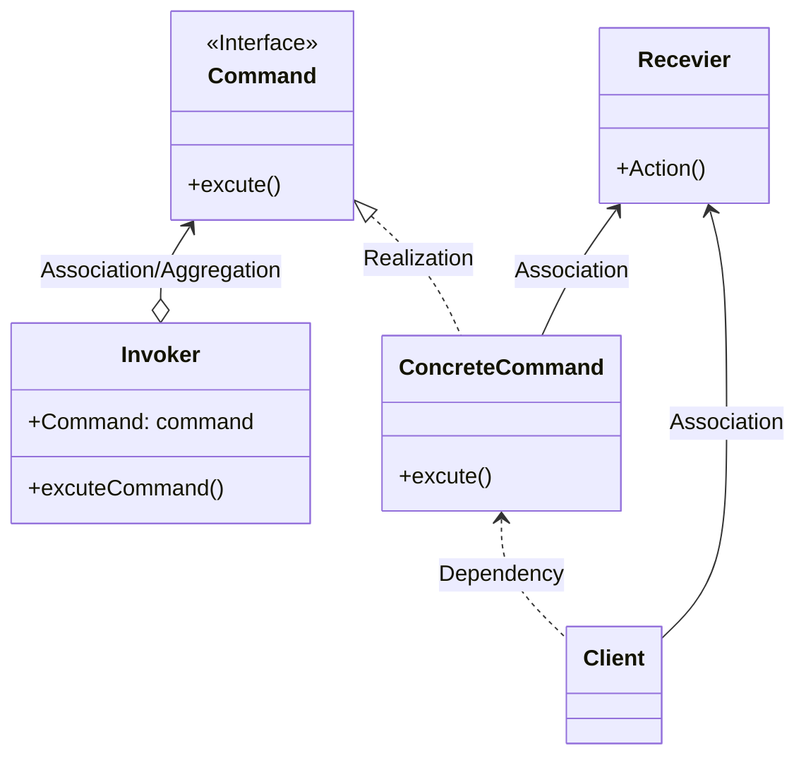

# Command Pattern

    

## 커맨드 패턴이란 ?

> 명령(행동)을 추상화하는 구조를 말한다.  
> 호출자, 명령, 명령구현체, 수신자, 사용자로 나뉜다.  
> 
> ___"커맨드 패턴은 명령(행동)들의 결합도에 따라 수신자를 사용하거나, 사용하지 않는 방법으로 분류된다."___

### 호출자(Invoker)
- 명령을 포함하는 대상으로 명령을 실행하는 대상이다.  

### 명령(Command)
- 인터페이스로 추상화된 명령(행동)을 말한다.  

### 명령구현체(ConcreteCommand)
- 직/간접적으로 논리적 명령(행동)을 수행하는 대상이다.

### 수신자(Receiver)
- 선택적 대상으로 명령구현체에 포함되며 논리적 행동을 대리수행하는 대상이다.  

### 사용자(Client)
- 명령을 사용하는 대상으로 구현체에 의존성을 있으며, 호출자에게 명령수행을 요청한다.

## Java API 사용사례
- `javax.swing.Action` 와 관련된 모든 구현체
- `java.lang.Runnable` 와 관련된 모든 구현체

### 설명
> `java.lang.Runnable` 를 예시로 들어보자.  
> `Thread(호출자)`, `Runnable(명령)`, `RunnableImpl(명령구현체)` 로 나뉜다.  
> 사용자는 `RunnableImpl implements Runnable` 구현체를 작성하고,  
> 상황에 따라 필요한 명령(행동)을 `Thread(호출자)` 객체가 관리하도록 전달하여 사용한다.  
> `Runnable` 의 경우 기본적으로 `Receiver` 를 포함하지 않아 자유도가 높다.  
> 하지만 필요에 따라 `RunnableImpl` 에 `Receiver(수신자/대리수행)` 를 포함시켜 사용할 수 있다.  

---

Diagram source

