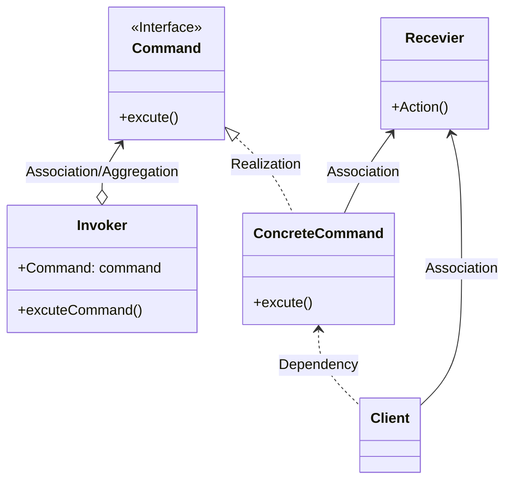

# Command Patten

Diagram source

```mermaid
classDiagram
    class Command{
    <<Interface>>
        +excute()
    }
    class ConcreteCommand{
        +excute()
    }
    class Invoker{
        +Command: command
        +excuteCommand()
    }
    class Recevier{
        +Action()
    }
    class Client{
    }

    Command <--o Invoker : Association/Aggregation
    Command <|.. ConcreteCommand : Realization
    Recevier <-- ConcreteCommand : Association
    Recevier <-- Client : Association
    ConcreteCommand <.. Client : Dependency
```

