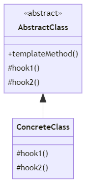
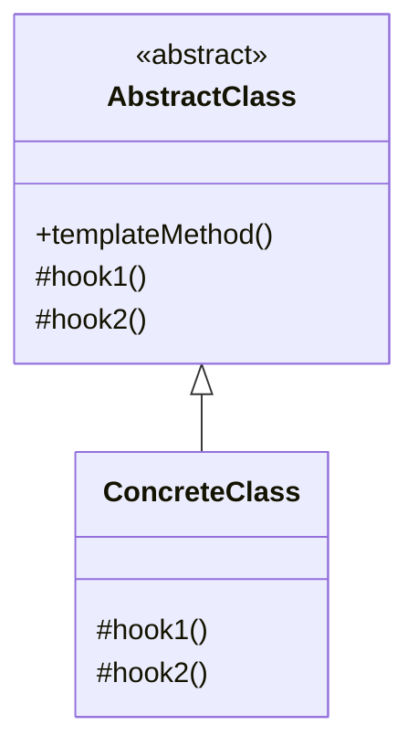

# Template-method Pattern



## 템플릿 메소드 패턴이란 ?

> 메소드를 통해 클래스의 동작을 규정하는 구조

## Java API 사용사례

- `org.springframework.security.config.annotation.web.configuration.WebSecurityConfigurerAdapter` 을 이용한 보안설정

```java
public abstract class WebSecurityConfigurerAdapter implements WebSecurityConfigurer<WebSecurity> {

    ...

    protected final HttpSecurity getHttp() throws Exception {
        if (this.http != null) {
            return this.http;
        }
        AuthenticationEventPublisher eventPublisher = getAuthenticationEventPublisher();
        this.localConfigureAuthenticationBldr.authenticationEventPublisher(eventPublisher);
        AuthenticationManager authenticationManager = authenticationManager();
        this.authenticationBuilder.parentAuthenticationManager(authenticationManager);
        Map<Class<?>, Object> sharedObjects = createSharedObjects();
        this.http = new HttpSecurity(this.objectPostProcessor, this.authenticationBuilder, sharedObjects);
        if (!this.disableDefaults) {
            applyDefaultConfiguration(this.http);
            ClassLoader classLoader = this.context.getClassLoader();
            List<AbstractHttpConfigurer> defaultHttpConfigurers = SpringFactoriesLoader
                    .loadFactories(AbstractHttpConfigurer.class, classLoader);
            for (AbstractHttpConfigurer configurer : defaultHttpConfigurers) {
                this.http.apply(configurer);
            }
        }
        configure(this.http);
        return this.http;
    }
}
```

## 설명

- 자바를 이용할 경우 template 성격에 맞도록 `abstract class` 기반 클래스에 정의하여 상속클래스를 요구하게 제한한다.
- 또한 메소드의 불변성을 위해서 `final` 을 사용하여 `@Override` 를 막는다.
- 해당 메소드는 템플릿 기능으로 제한할 내용을 구현해둔다.
- 보통 `chaining` , `init` 등의 내용을 구현된다.
- 해당 메소드에서 사용할 기능을 구현체에서 재정의해야할 경우, 사용자는 좀더 유연한 템플릿을 사용한다.

---

<details>
<summary>참조</summary>
    
</details>
    
<details>
<summary>Diagram source</summary>



</details>

